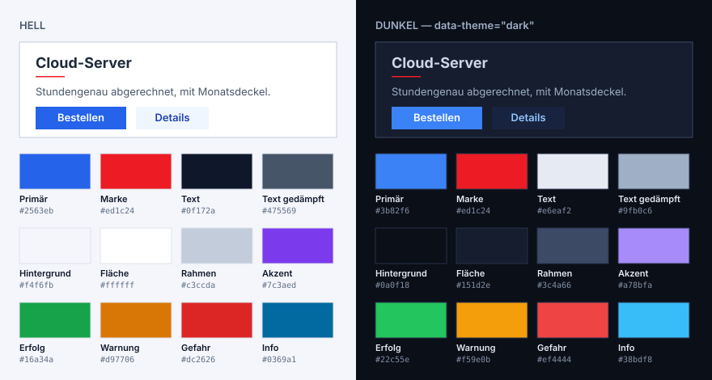
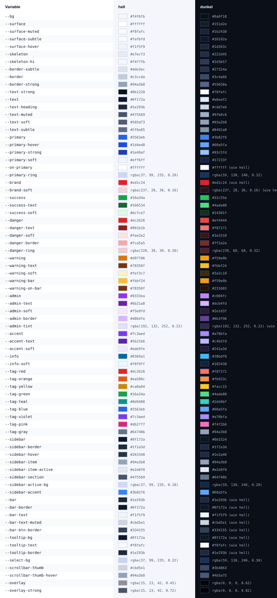

# INFORENT Brand

Die **eine Quelle** der Corporate Identity: Design-Tokens als CSS-Variablen und die Wortmarke.
Portal ([INFORENT-Portal](https://github.com/INFORENT-GmbH/INFORENT-Portal)) und Website
([INFORENT-Website](https://github.com/INFORENT-GmbH/INFORENT-Website)) beziehen beide dieses Paket —
keiner der beiden definiert Farben selbst.

| Datei | Inhalt |
|---|---|
| `tokens.css` | drei `:root`-Regeln: Geometrie (Abstände, Radien, Schriftgrößen, Schatten, Dauer), helle Palette, dunkle Palette (`:root[data-theme='dark']`) |
| `base.css` | globale Element-Regeln aller Oberflächen: Fokusrahmen, Formularfelder, Buttons (Hover, deaktiviert), Textauswahl, Scrollbalken, Skip-Link, reduzierte Bewegung — aus dem Portal übernommen |
| `vars.js` / `vars.d.ts` | jede Variable als typisierte Konstante: `vars.textMuted` = `'var(--text-muted)'`, dazu `values.light` / `values.dark` mit den aufgelösten Werten für Canvas, WebGL und SVG-Attribute (erzeugt aus `tokens.css`) |
| `components.css` / `components.js` | die Optik der Bausteine — Knopf, Feld, Abzeichen, Hinweis, Karte, Fläche, Aktionsleiste — als Klassen (`ir-*`) und als typisierte Stilobjekte; beides aus `components.def.mjs` erzeugt |
| `logo.png` | die Wortmarke (200 × 110, dunkle Grafik) |
| `bin/brand-lint.mjs` | Prüfskript für die Verbraucher (siehe unten) |




<details>
<summary>Alle Farbvariablen (hell | dunkel)</summary>



</details>

Die Bilder erzeugt `npm run preview` aus `tokens.css`; `npm run check` schlägt fehl, wenn sie nicht
mehr passen.

**Styleguide für Menschen:** [brand.inforent.com](https://brand.inforent.com) — Farben mit Rolle,
Schrift, Wortmarke, Raster und Regeln, hell und dunkel. Erzeugt `npm run site` aus `tokens.css`
(`site-dist/`, nicht eingecheckt); die Action `site` baut und lädt bei jedem Push auf `main` und
jedem Tag per SFTP hoch (Secrets `SFTP_HOST`, `SFTP_PORT`, `SFTP_USER`, `SFTP_PASSWORD`, Kopf von
`.github/workflows/site.yml`). Die Seite ist keine Einbinde-Adresse — Projekte beziehen das Paket
über das Release.

Bedeutung und Regeln der Werte (wann `--brand`, wann `--primary`, Kontraste, Schriften):
`docs/areas/brand.md` im Portal-Repo.

## Einbinden

Das Paket liegt nicht auf npmjs.com, sondern als Anhang am GitHub-Release — eine feste Datei,
deren Prüfsumme im `package-lock.json` steht:

```bash
npm install https://github.com/INFORENT-GmbH/INFORENT-Brand/releases/download/v1.1.0/inforent-brand-1.1.0.tgz
```

```ts
import '@inforent/brand/tokens.css'   // zuerst — die Werte
import '@inforent/brand/base.css'     // dann die gemeinsamen Element-Regeln
import './eigenes.css'                // zuletzt das Projekt-CSS (gewinnt per Kaskade)
import { vars } from '@inforent/brand/vars'
import logo from '@inforent/brand/logo.png'

const card = { background: vars.surface, border: `1px solid ${vars.border}`, borderRadius: vars.radiusLg }
```

`vars.*` statt Zeichenketten: ein Tippfehler oder eine Variable, die eine neue Brand-Version
entfernt hat, ist ein **Compile-Fehler** statt eines stumm leeren Werts im Browser.

Dunkelmodus: `data-theme="dark"` auf `<html>` setzen, alle Variablen schalten mit.

## Regeln

- **Die Variablennamen sind die Schnittstelle.** Neuer Name oder geänderter Wert → Minor
  (`1.1.0`); Name umbenannt oder entfernt → Major (`2.0.0`), weil ein Verbraucher ihn noch lesen
  kann.
- **Werte, Grundregeln, Baustein-Optik — kein Verhalten.** Zwischen `BEGIN tokens` und `END tokens`
  stehen ausschließlich die drei `:root`-Regeln (`npm run check` prüft das, das Portal auch).
  `components.css` ist opt-in und nur Klassen mit Präfix `ir-`; React-Komponenten, Dialog-Fokus
  und Routing bleiben im jeweiligen Projekt.
- Abweichungen eines Verbrauchers (z. B. größere Schriften der Website) gehören in dessen eigenes
  CSS *nach* dem Import — nie hierher.
- **Eckig:** `--radius-xxs` bis `--radius-xl` sind `0px` — Flächen sind Rechtecke mit sichtbarem
  Rahmen, die Tiefe kommt vom Rahmen, nicht von Rundung. Nur `--radius-pill` (999px) bleibt rund,
  für Meter und Schieberegler. Verbraucher setzen **keine eigenen Radien**, sondern nutzen immer
  `var(--radius-*)` — so folgen Portal und Website automatisch, falls sich das je ändert.
- Keine Verläufe, `--brand` (#ed1c24) nie als Button-Fläche und nie als Text unter ~24 px.

## Bausteine

Die Optik der gemeinsamen Bausteine, damit ein Knopf auf der Website aussieht wie im Portal.
Vorschau aller Varianten: [brand.inforent.com](https://brand.inforent.com/#bausteine).

```html
<button class="ir-btn ir-btn--md ir-btn--primary">Speichern</button>
<a class="ir-btn ir-btn--md" href="/kontakt">Kontakt</a>
<input class="ir-input" placeholder="Hostname">
<span class="ir-badge ir-badge--md ir-badge--success">Läuft</span>
<div class="ir-alert ir-alert--info">Hinweis</div>
```

```ts
import '@inforent/brand/components.css'                       // Klassen
import { button, input, badge } from '@inforent/brand/components' // oder als Stilobjekte (React)
const style = { ...button.base, ...button.sizes.md, ...button.variants.primary }
```

| Baustein | Klassen | Regel |
|---|---|---|
| Knopf | `ir-btn` + `--xs`/`--sm`/`--md` + `--primary`/`--secondary`/`--ghost`/`--danger`/`--danger-outline`/`--admin` | Hauptaktion `primary` (eine je Maske, ganz rechts), Abbrechen `secondary` links daneben, Löschen `danger-outline` (gefüllt nur im Bestätigungsdialog), Umschalten `secondary`, `ghost` für Drittaktionen im Inhalt, `admin` nur für Neben-Aktionen. Eine Leiste, eine Höhe. |
| Feld | `ir-input` (+ `--sm`/`--lg`, `--mono`, `--admin`, `ir-textarea`); `aria-invalid="true"`, `readonly` | Höhe = `--control-height`, gleich Knopf `md` und Auswahlliste |
| Abzeichen | `ir-badge` + `--sm`/`--md` + Ton (`--neutral`/`--primary`/`--success`/`--danger`/`--warning`/`--info`/`--accent`), optional `--solid`/`--outline` | Farbe nie allein — immer mit Wort |
| Hinweis | `ir-alert` + `--error`/`--warning`/`--success`/`--info` | |
| Fläche | `ir-card` (`--admin`), `ir-panel` + `--plain`/`--muted`/`--inset`, `--pad` | |
| Aktionsleiste | `ir-action-bar`; Knöpfe darin zusätzlich `ir-btn--on-bar` | Anzahl links, Aktionen rechts, „Auswahl aufheben“ zuletzt |

Hover, Fokus und gesperrt kommen aus `base.css` — beide Dateien laden.

## brand-lint — Pflicht in beiden Projekten

Das Paket bringt ein Prüfskript mit, das Portal und Website in ihrer CI laufen lassen. Die Regeln
sind mit der Brand versioniert: eine neue Regel erreicht beide Projekte mit dem nächsten Update.

```bash
npx brand-lint site/                                         # Website
npx brand-lint --baseline brand-lint-baseline.json src …     # Portal (mit Ratsche)
```

| Regel | findet | stattdessen |
|---|---|---|
| `color` | `#hex`, `rgb()`, `hsl()` … im Code | `var(--…)` bzw. `vars.*` |
| `gradient` | `linear-/radial-/conic-gradient` | — die Brand hat keine Verläufe |
| `radius` | Eckenradius ≠ 0 als Zahl, eigene Radius-Skala | `var(--radius-*)` / `vars.radius*` (eckig) |
| `font` | Schriftfamilie als Text | `var(--ui-font)` / `var(--mono-font)` |
| `font-cdn` | Google Fonts, Typekit … | selbst hosten (`@fontsource`) |
| `unknown-var` | `var(--x)`, das es weder in der Brand noch im Projekt gibt | Tippfehler beheben / Namen aus der Brand |

Ausgenommen sind die generierten Brand-Kopien (zwischen `BEGIN tokens`/`END tokens` bzw.
`BEGIN base`/`END base`) und Kommentare. `<meta name="theme-color">` darf einen Hex-Wert tragen,
wenn er in der Brand vorkommt (dort funktioniert `var()` nicht).

**Begründete Ausnahme:** Kommentar `brand-allow: <Grund>` in derselben oder der Zeile darüber, oder
ein Block `brand-allow-start: <Grund>` … `brand-allow-end` (z. B. eine Diagrammpalette für
Canvas/SVG, eine fremde Marke). Ohne Grund zählt die Markierung nicht.

**Baseline (Ratsche):** `--baseline <datei>` erlaubt die bestehenden Befunde je Datei und Regel,
nur *mehr* schlägt fehl; `--write-baseline` schreibt den aktuellen Stand fest (auch nach dem Abbau).

## Neue Version veröffentlichen

1. Änderung per Pull Request, danach `npm run gen` (vars) und `npm run preview` (Vorschaubilder);
   `npm run check` muss grün sein.
2. `version` in `package.json` hochzählen, Eintrag in `CHANGELOG.md`.
3. Annotierten Tag setzen und pushen — der Tag-Text wird die Release-Notiz:
   ```bash
   git tag -a v1.1.0 -m "v1.1.0: --foo ergänzt"
   git push origin main v1.1.0
   ```
   Die Action `release` baut das Paket und hängt `inforent-brand-1.1.0.tgz` ans Release.
4. In Portal und Website die URL in `package.json` auf die neue Version setzen und `npm install`.
   Im Portal danach `npm run tokens:write` in `web/` (schreibt `tokens.css` und `base.css` in
   `index.html` und die Nebenseiten) und committen. `npm run lint` zeigt, ob neue Regeln greifen.
